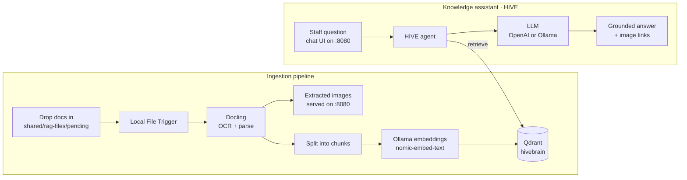
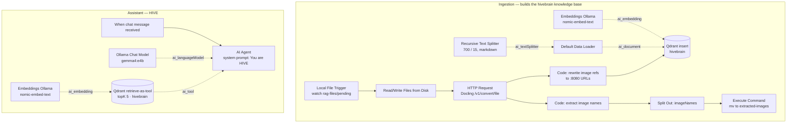

# HIVE

**HIVE is the self-hosted AI "second brain" for [Honey Bridge](https://www.gohoneybridge.com/).**

It turns the agency's internal documents — meeting notes, SOPs, client material, research — into a private, searchable knowledge base that the team can simply *talk to*. Everything runs locally via Docker, so nothing leaves your machine.

---

## About Honey Bridge

[Honey Bridge](https://www.gohoneybridge.com/) is an SEO and design studio with one specialty:

> **"SEO & Design for Halal Restaurants in Boston"**

Instead of à la carte services, Honey Bridge delivers a single integrated six-part system — brand identity, custom website design, local SEO infrastructure, food photography with metadata optimization, editorial content, and platform optimization across Google Maps, Yelp, DoorDash, and other digital storefronts. It's built once and continuously optimized by the same founding team, with a focus on getting brick-and-mortar halal restaurants ranked — typically within about 60 days. The premise: halal restaurants in Boston are underserved by mainstream marketing agencies.

HIVE is the internal tooling that keeps that small, hands-on team fast — a shared memory they can query instead of digging through files.

---

## What HIVE is

HIVE is a self-hosted AI stack — a **second brain** — made up of a few cooperating parts:

- **🐝 Ingestion pipeline** — watches a folder, OCRs and parses whatever you drop in, then embeds it into a private vector knowledge base (`hivebrain`).
- **💬 Knowledge assistant** — a chat agent (it speaks as *HIVE*) that answers questions *strictly* from that knowledge base, cites its sources, and says "I'm not sure" instead of guessing.
- **➕ …and more** — HIVE is built to grow. A supporting Image Processing pipeline already handles extracted figures, and new agents/automations can plug into the same stack.

---

## How it works



### Ingestion pipeline
*n8n workflow: `HoneyBridge RAG Ingestion Pipeline`*

1. A **Local File Trigger** watches `shared/rag-files/pending/`.
2. Each new file is sent to **Docling** (`http://docling:5001`) for OCR and structured parsing.
3. Extracted **images** are written to `shared/extracted-images/` and served by the static file server on `:8080`.
4. The text is **split** into chunks and **embedded** with Ollama (`nomic-embed-text`).
5. Embeddings are upserted into the **Qdrant** collection **`hivebrain`** — HIVE's memory.

### Knowledge assistant
*The agent's system prompt: "You are HIVE, the internal knowledge assistant for Honey Bridge…"*

1. A team member asks a question through the chat UI (`:8080`) or the n8n chat webhook.
2. HIVE **must** query the `hivebrain` collection before responding — it never answers from the model's own knowledge.
3. It returns a grounded answer, rendering any relevant images as markdown using their `:8080` URLs.
4. If the knowledge base has nothing relevant, it says so instead of guessing.

### The workflow in n8n

The actual node graph — solid arrows are the data flow, dotted arrows feed the LangChain sub-nodes (models, embeddings, retriever):



> 📸 These diagrams are generated from the live workflow JSON. For pixel-perfect canvas shots, open the workflow at http://localhost:5678 and drop screenshots into `assets/`.

---

## Stack

| Service | Role | URL |
|---|---|---|
| **n8n** | Orchestrates the ingestion pipeline and the HIVE agent | http://localhost:5678 |
| **Qdrant** | Vector store — holds the `hivebrain` knowledge base | http://localhost:6333 |
| **Ollama** | Local embeddings + optional local LLM | http://localhost:11434 |
| **Docling** | OCR / document parsing | http://localhost:5001 |
| **PostgreSQL** | n8n's database (workflows, credentials, executions) | internal |
| **Static files** | Serves extracted images + the chat UI | http://localhost:8080 |

---

## Prerequisites

- [Docker](https://www.docker.com/) + Docker Compose
- An **OpenAI API key** if HIVE should use a cloud LLM (otherwise it runs fully local on Ollama)

On macOS, the bootstrap script below installs all of this for you.

---

## Install dependencies

### macOS

A bootstrap script installs everything the stack needs — **Homebrew, Docker Desktop, Git, GitHub CLI, GitHub Desktop, and Ollama**. It's idempotent, so it skips whatever you already have.

**On a fresh machine** (no git yet) — download and run it, then clone the repo:

```bash
curl -fsSLO https://raw.githubusercontent.com/abdullahasayed/honeybridge-ai-stack/main/scripts/setup.sh
bash setup.sh
```

**If you've already cloned the repo:**

```bash
./scripts/setup.sh
```

Add the optional AI developer tools (**Claude Code, ChatGPT, Codex**) with a flag:

```bash
./scripts/setup.sh --with-dev-tools
```

> Targets macOS. On Linux, install the equivalents (`docker`, `git`, `gh`, `ollama`) with your package manager. After it runs, open Docker Desktop once to accept its license.

### Windows

A PowerShell script uses **winget** to install the same core tools — **Git, GitHub CLI, GitHub Desktop, Docker Desktop, Ollama**. Run it in an **elevated PowerShell** (Run as Administrator).

**On a fresh machine** (no git yet) — download and run it, then clone the repo:

```powershell
irm https://raw.githubusercontent.com/abdullahasayed/honeybridge-ai-stack/main/scripts/setup.ps1 -OutFile setup.ps1
powershell -ExecutionPolicy Bypass -File .\setup.ps1
```

**If you've already cloned the repo:**

```powershell
powershell -ExecutionPolicy Bypass -File .\scripts\setup.ps1
```

Add the optional AI developer tools (**Claude Code, ChatGPT, Codex**) with a flag:

```powershell
powershell -ExecutionPolicy Bypass -File .\scripts\setup.ps1 -WithDevTools
```

> Requires `winget` (ships with Windows 11 and recent Windows 10). Docker Desktop needs **WSL2** — accept its first-run prompt, or run `wsl --install` in an admin terminal and reboot. The bash-style `docker`/restore commands below run in **Git Bash** or **WSL**.

---

## Quick start

```bash
git clone https://github.com/abdullahasayed/honeybridge-ai-stack.git
cd honeybridge-ai-stack
cp .env.example .env   # then edit the secrets — see Configuration below
```

Start everything (the `--profile cpu` is required so Docling starts too):

```bash
# Mac / Apple Silicon and CPU-only machines
docker compose --profile cpu up

# NVIDIA GPU
docker compose --profile gpu-nvidia up

# AMD GPU (Linux)
docker compose --profile gpu-amd up
```

On first run the ingestion and image-processing workflows are imported automatically, and Ollama pulls its base model. Open n8n at http://localhost:5678 to confirm both workflows are active.

> **Models:** HIVE embeds with `nomic-embed-text` and chats on a local Ollama model (`gemma4:e4b`); an OpenAI model (`gpt-5.5`) is configured in the workflow as a drop-in alternative. Pull any local models you need, e.g. `docker exec ollama ollama pull nomic-embed-text`.

---

## Using it

### Feed the second brain
Drop documents (PDFs, etc.) into:

```
shared/rag-files/pending/
```

The Local File Trigger picks them up, Docling parses them, and the chunks land in the `hivebrain` Qdrant collection automatically. Extracted images become available at http://localhost:8080.

### Ask HIVE
Open the chat UI at **http://localhost:8080**, or use the chat trigger on the HIVE workflow inside n8n. Ask anything about Honey Bridge's internal material — HIVE retrieves from `hivebrain` and answers with sources.

---

## Configuration & secrets

All secrets live in `.env` (which is **gitignored — never commit it**):

| Variable | Purpose |
|---|---|
| `N8N_ENCRYPTION_KEY` | Encrypts stored credentials. **Must stay constant** — lose it and every saved credential becomes undecryptable. |
| `N8N_USER_MANAGEMENT_JWT_SECRET` | Signs n8n login sessions. |
| `POSTGRES_USER` / `POSTGRES_PASSWORD` / `POSTGRES_DB` | n8n's database. |

> This public repo ships **without** n8n credential exports. After first boot, open n8n → **Credentials** and add your own (Qdrant, Ollama, and an OpenAI key if you use the cloud model).

---

## Backup & restore

HIVE's functional state lives in two Docker volumes (plus the `.env` key) — not in this repo:

- **PostgreSQL** — workflows, credentials, execution history
- **Qdrant** — the `hivebrain` vector knowledge base

**Back up:**
```bash
mkdir -p volume-backups
docker compose exec -T postgres pg_dump -U root -d n8n --clean --if-exists --no-owner \
  > volume-backups/n8n-postgres.sql
docker compose stop
docker run --rm -v honeybridge-ai-stack_qdrant_storage:/data \
  -v "$PWD/volume-backups":/backup alpine sh -c "cd /data && tar czf /backup/qdrant_storage.tar.gz ."
```

**Restore on a fresh machine** (after placing `.env` and `volume-backups/` in the project root):
```bash
touch n8n/demo-data/.imported          # skip auto-import so the DB isn't duplicated
docker compose --profile cpu create
docker run --rm -v honeybridge-ai-stack_qdrant_storage:/data \
  -v "$PWD/volume-backups":/backup alpine sh -c "cd /data && tar xzf /backup/qdrant_storage.tar.gz"
docker compose up -d postgres && sleep 10
docker compose exec -T postgres psql -U root -d n8n < volume-backups/n8n-postgres.sql
docker compose --profile cpu up -d
```

Keep `.env` and `volume-backups/` out of git and transfer them out-of-band.

---

## Credits

Built on the [self-hosted-ai-starter-kit](https://github.com/n8n-io/self-hosted-ai-starter-kit) by n8n, with [Docling](https://github.com/docling-project/docling-serve) for document parsing. Licensed under Apache 2.0 — see [LICENSE](LICENSE).
