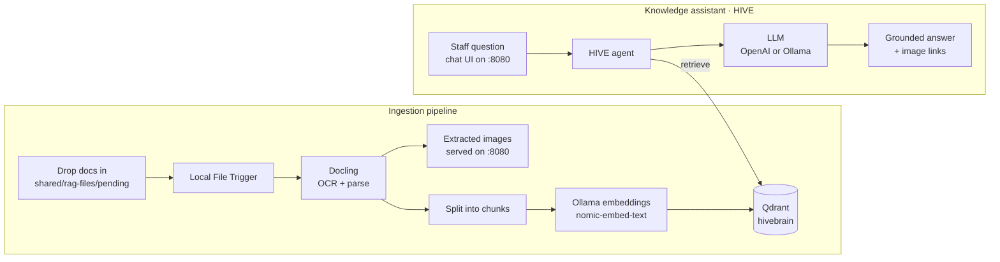
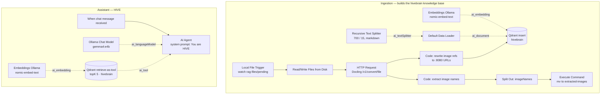

# HIVE

**A self-hosted AI "second brain" — a private, retrieval-augmented knowledge assistant.**

HIVE turns an organization's internal documents into a searchable knowledge base its team can query in plain language. Everything runs on local infrastructure: documents, embeddings, and inference never leave the host. It was built for [Honey Bridge](https://www.gohoneybridge.com/), a small SEO and design studio, as the shared memory its team queries instead of digging through files.

*Built with n8n · Qdrant · Ollama · Docling · PostgreSQL · Docker Compose.*

---

## What it does

- **Ingestion pipeline** — watches a folder, OCRs and parses any document dropped in, then chunks and embeds it into a private vector store (`hivebrain`).
- **Knowledge assistant** — a chat agent (it answers as *HIVE*) that responds **strictly** from the knowledge base, cites its sources, and admits uncertainty instead of guessing.
- **Extensible by design** — a supporting image-processing pipeline runs alongside it, and new agents plug into the same stack.

---

## Architecture



**Ingestion** *(n8n workflow: `HoneyBridge RAG Ingestion Pipeline`)* — a Local File Trigger watches `shared/rag-files/pending/`. Each document is parsed by Docling (OCR + structure), split into chunks, embedded with Ollama (`nomic-embed-text`), and upserted into the Qdrant `hivebrain` collection. Extracted images are served over HTTP so the assistant can link to them.

**Assistant** — a question, from the bundled chat UI or the n8n chat webhook, reaches an AI Agent whose system prompt requires it to query `hivebrain` before answering. It returns a grounded response with inline image links and source attribution, and says when the knowledge base has nothing relevant rather than inventing an answer.

### Implementation (n8n node graph)

Solid arrows are the data flow; dotted arrows feed the LangChain sub-nodes (models, embeddings, retriever):



---

## Stack

| Service | Role | URL |
|---|---|---|
| **n8n** | Orchestrates the ingestion pipeline and the HIVE agent | http://localhost:5678 |
| **Qdrant** | Vector store — holds the `hivebrain` knowledge base | http://localhost:6333 |
| **Ollama** | Local embeddings + LLM inference | http://localhost:11434 |
| **Docling** | OCR / document parsing | http://localhost:5001 |
| **PostgreSQL** | n8n's database (workflows, credentials, executions) | internal |
| **Static files** | Serves extracted images + the chat UI | http://localhost:8080 |

---

## Install dependencies

Requires Docker + Docker Compose (the setup scripts install these). An OpenAI API key is optional — HIVE runs fully local on Ollama otherwise.

### macOS

Installs Homebrew, Docker Desktop, Git, GitHub CLI / Desktop, and Ollama. Idempotent — skips whatever you already have.

```bash
# Fresh machine (no git yet):
curl -fsSLO https://raw.githubusercontent.com/abdullahasayed/honeybridge-ai-stack/main/scripts/setup.sh && bash setup.sh

# Already cloned:
./scripts/setup.sh                    # core tools
./scripts/setup.sh --with-dev-tools   # + Claude Code, ChatGPT, Codex
```

> Targets macOS; on Linux install the equivalents (`docker`, `git`, `gh`, `ollama`). Open Docker Desktop once afterward to accept its license.

### Windows

A PowerShell + `winget` script installs the same core tools. Run it in an **elevated PowerShell**.

```powershell
# Fresh machine (no git yet):
irm https://raw.githubusercontent.com/abdullahasayed/honeybridge-ai-stack/main/scripts/setup.ps1 -OutFile setup.ps1; powershell -ExecutionPolicy Bypass -File .\setup.ps1

# Already cloned:
powershell -ExecutionPolicy Bypass -File .\scripts\setup.ps1                # core tools
powershell -ExecutionPolicy Bypass -File .\scripts\setup.ps1 -WithDevTools  # + dev tools
```

> Needs `winget` (Windows 11 / recent 10) and WSL2 for Docker Desktop. Run the bash-style commands below in Git Bash or WSL.

---

## Quick start

```bash
git clone https://github.com/abdullahasayed/honeybridge-ai-stack.git
cd honeybridge-ai-stack
cp .env.example .env   # then edit the secrets — see Configuration
```

Start everything — pick the **one** profile that matches your hardware. A profile is required: it starts Ollama and Docling (without one, only the core services come up).

```bash
docker compose --profile cpu up          # Mac / Apple Silicon / CPU-only
docker compose --profile gpu-nvidia up   # NVIDIA GPU
docker compose --profile gpu-amd up      # AMD GPU (Linux)
```

On first run the workflows import automatically and Ollama pulls HIVE's models into the container. Open n8n at http://localhost:5678 to confirm both workflows are active.

> **Models:** embeddings use `nomic-embed-text`; chat uses local Ollama (`gemma4:e4b`), with OpenAI (`gpt-5.5`) wired as a drop-in alternative. Both Ollama models are pulled automatically on first `up`.

---

## Usage

**Feed the knowledge base** — drop documents (PDFs, etc.) into `shared/rag-files/pending/`. The ingestion pipeline parses, chunks, and embeds them into `hivebrain` automatically; extracted images appear at http://localhost:8080.

**Ask HIVE** — open the chat UI at http://localhost:8080 (or use the chat trigger inside n8n) and ask anything in the corpus. HIVE retrieves from `hivebrain` and answers with sources.

---

## Configuration

Secrets live in `.env` (**gitignored — never commit it**):

| Variable | Purpose |
|---|---|
| `N8N_ENCRYPTION_KEY` | Encrypts stored credentials. **Must stay constant** — lose it and every saved credential becomes undecryptable. |
| `N8N_USER_MANAGEMENT_JWT_SECRET` | Signs n8n login sessions. |
| `POSTGRES_USER` / `POSTGRES_PASSWORD` / `POSTGRES_DB` | n8n's database. |

> This repo ships **without** n8n credential exports. After first boot, open n8n → **Credentials** and add your own (Qdrant, Ollama, and an OpenAI key if used).

---

## Backup & restore

State lives in two Docker volumes (plus the `.env` key), not in the repo: **PostgreSQL** (workflows, credentials, history) and **Qdrant** (the `hivebrain` vectors).

**Back up:**
```bash
mkdir -p volume-backups
docker compose exec -T postgres pg_dump -U root -d n8n --clean --if-exists --no-owner \
  > volume-backups/n8n-postgres.sql
docker compose stop
docker run --rm -v honeybridge-ai-stack_qdrant_storage:/data \
  -v "$PWD/volume-backups":/backup alpine sh -c "cd /data && tar czf /backup/qdrant_storage.tar.gz ."
```

**Restore** (place `.env` and `volume-backups/` in the project root first):
```bash
touch n8n/demo-data/.imported          # skip auto-import so the DB isn't duplicated
docker compose --profile cpu create
docker run --rm -v honeybridge-ai-stack_qdrant_storage:/data \
  -v "$PWD/volume-backups":/backup alpine sh -c "cd /data && tar xzf /backup/qdrant_storage.tar.gz"
docker compose up -d postgres && sleep 10
docker compose exec -T postgres psql -U root -d n8n < volume-backups/n8n-postgres.sql
docker compose --profile cpu up -d
```

Keep `.env` and `volume-backups/` out of git and transfer them out-of-band.

---

## Credits

Built on the [self-hosted-ai-starter-kit](https://github.com/n8n-io/self-hosted-ai-starter-kit) by n8n, with [Docling](https://github.com/docling-project/docling-serve) for document parsing. Licensed under Apache 2.0 — see [LICENSE](LICENSE).
